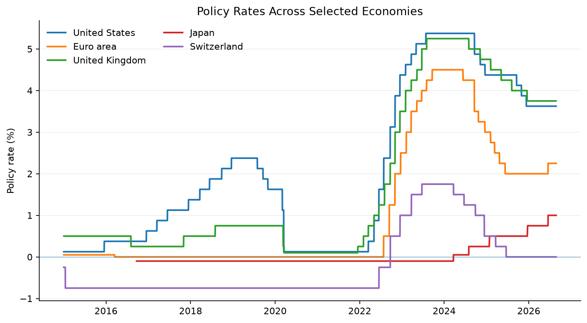

# BIS Policy Rate Monitor

> Latest central-bank policy rates and recent developments from the Bank for International Settlements.

**Generated:** 2026-08-31 20:32 UTC  
**Period:** 2015-01-01 → latest available observation  
**Coverage:** United States, Euro area, United Kingdom, Japan, Switzerland  
**Requested:** US, EA, GB, JP, CH  
**BIS codes:** US, XM, GB, JP, CH  

---

## Latest Policy Rate Snapshot

| Country / Area   |    Rate | Latest Date   |   Monthly Δ | Last Move   | Last Change   |   Days Since Last Change |
|:-----------------|--------:|:--------------|------------:|:------------|:--------------|-------------------------:|
| United States    | 3.6250% | 2026-08-25    |           — | ↓ 0.2500 pp | 2025-12-11    |                      257 |
| Euro area        | 2.2500% | 2026-08-25    |           — | ↑ 0.2500 pp | 2026-06-17    |                       69 |
| United Kingdom   | 3.7500% | 2026-08-24    |           — | ↓ 0.2500 pp | 2025-12-18    |                      249 |
| Japan            | 1.0000% | 2026-08-25    |           — | ↑ 0.2500 pp | 2026-06-17    |                       69 |
| Switzerland      | 0.0000% | 2026-08-25    |           — | ↓ 0.2500 pp | 2025-06-20    |                      431 |

*Monthly Δ compares the latest observation with the final available observation before the current month. ↑ indicates a hike, ↓ a cut, and — no change.*

---

## Policy Rate Developments

Policy-rate developments across the selected economies over the reporting period.

*Figure 1. Central-bank policy rates over time. Daily observations are shown where available, with monthly observations used as a fallback.*

---

## Methodology

Daily observations are used when available, with monthly observations used as a fallback. Monthly change compares the latest policy rate with the final available observation before the current month.

The last change is the most recent non-zero policy-rate move within the selected reporting period. Days since change is measured from that observation to the latest available observation. Missing BIS observations are retained during transformation but excluded from calculations.

## Data Source

**Bank for International Settlements (BIS)**  
Central bank policy rates — bulk-download dataset.
